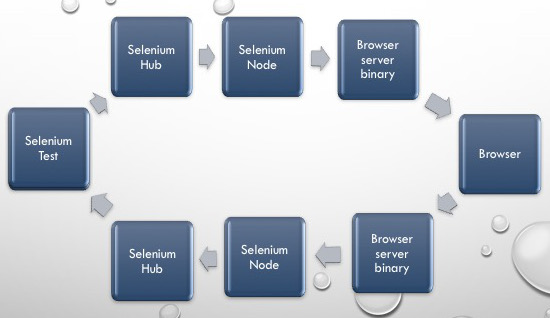

<p align="center"> 

</p>

# Getting started with Selenium Grid

1. [**_Prequisites_**](#prequisite)
2. [**_Configuring the server binaries_**](#configure)
3. [**_Starting the Hub and Node_**](#starthubnode)
4. [**_The journey of a test case_**](#journey)

Sometimes we might end up with the need to run our Selenium tests on a different machine. The reasons why we might want to do this could be many. Here are a few reasons :

* You don't want your machine usage (maybe you are using your desktop/laptop for  some casual browsing, but are worried that it might interfere with the Selenium tests that you are running from your local machine) to interfere with Selenium tests. 
* You have a **Continuous Integration** setup for your selenium tests, wherein there's an orchestrator such as **Jenkins** (or) **Bamboo** (or) **TeamCity** which is continuously running your tests. Most often these build systems reside on a *headless* UNIX box wherein there's neither a display configured, nor are any of the web browsers installed. So in that case, you might want your tests to be still executed by one of these systems but have all the browser instantiation and actions on the browsers happen in a remote environment where the grid is running.

Ok so enough of stories.. :)
Here's what you need to get a Selenium Grid up and running.

## Pre-requistes : <a name='prequisite'></a>

1. The below server binaries are required to be downloaded :  
  1. `chromedriver` - If you are going to be running tests on Chrome. Refer [**_here_**](https://sites.google.com/a/chromium.org/chromedriver/) to learn more.
  2. `geckodriver` - If you are going to be running tests on Firefox. Refer [**_here_**](https://github.com/mozilla/geckodriver/releases) to learn more.
  3. `safaridriver` - If you are going to be running tests on Safari. [ This now comes pre-bundled with `Sierra (v10.12.6)` and above.
  4. `iedriverserver` - If you are going to be running tests on Internet Explorer. Refer [**_here_**](https://github.com/SeleniumHQ/selenium/wiki/InternetExplorerDriver) to learn more.
  5. `edgedriver` - If you are going to be running tests on Microsoft Edge browser. Refer [**_here_**](https://docs.microsoft.com/en-us/microsoft-edge/dev-guide/tools/webdriver) to learn more.

  You don't need all of the above. It depends on what platform you are going to be running your Grid setup and also depends upon what browser flavor you would like to run tests against. For e.g., if you dont have a OSX, then you pretty much cannot include Safari. If you have only Linux boxes at your disposal, then you don't need either the `IEDriverServer` (or) the `EdgeDriver` because they are windows only binaries.  

2. JDK 8 or higher. The selenium codebase requires JDK8 atleast now to run.
3. The **Selenium standalone** jar downloaded from [**_here_**](http://selenium-release.storage.googleapis.com/index.html)

## How to configure the driver binaries <a name='configure'></a>

The driver binaries (`chromedriver `/`geckodriver`/`safaridriver`/`iedriverserver`/`edgedriver`) are what helps selenium interact with the actual browser. These binaries are now built and released by the respective browser manufacturers themselves because they know their browsers better than anyone else. Selenium relies on these binaries to talk to the actual browser.

In general there are two ways in which you can configure driver binaries.

1. By adding the directory wherein the driver binaries reside, as part of your `PATH` variable. Depending on what platform you are trying to update your `PATH` on, one of the below resources should be useful.

    1. [**_Unix_**](https://www.cyberciti.biz/faq/unix-linux-adding-path/)
    2. [**_Mac_**](https://www.cyberciti.biz/faq/appleosx-bash-unix-change-set-path-environment-variable/)
    3. [**_Windows_**](https://www.computerhope.com/issues/ch000549.htm)

2. Informing the server binary location via a JVM argument.

    1. For **chrome** use `-Dwebdriver.chrome.driver=<locationGoesHere>` For e.g., `-Dwebdriver.chrome.driver=/usr/local/bin/chromedriver` 
    2. For **firefox** use `-Dwebdriver.gecko.driver=<locationGoesHere>` For e.g., `-Dwebdriver.gecko.driver=/usr/local/bin/geckodriver`
    3. For **internet explorer** use `-Dwebdriver.ie.driver=<locationGoesHere>` For e.g., `-Dwebdriver.ie.driver=C:\Downloads`
    4. For **edge** use `-Dwebdriver.edge.driver` For e.g., `-Dwebdriver.edge.driver=C:\Downloads`

## Starting the Hub and Node <a name='starthubnode'></a>

**The hub** can be started via the command:

```
java -jar selenium-server-standalone-3.4.0.jar -role hub
```
This causes the `hub` to be started and listen on port `4444`.

**The node** can be started via the command :

```
java -jar selenium-server-standalone-3.4.0.jar -role node
```

This spins off a node with the following features :

* The node is listening on the port `5555` (this is the default port)
* The node registers itself to a hub that is running on the same machine on port `4444`.

## The journey of a test case <a name='journey'></a>

Ever wondered how does information flow back and forth between your testcase and the Grid ? Ever wondered how all this fits in ?

When your test tries to talk the Grid here's how the flow happens:

1. Your client bindings (it can be `Java/C#/Python/Javascript`) first creates a `JSON Payload` in which the most important thing that gets captured is the **browser flavor** (*This is applicable only when a new session request is created*). 
2. This `JSON Payload` is then forwarded to http://localhost:4444/wd/hub (For the sake of simplicity lets assume that our Hub is listening on port `4444` on `localhost`).
3. The Hub now tries to check which amongst its nodes has the capability to support the requested browser and then forwards the request to the node.
4. The node receives the payload and then spins off a server component which would be listening on a particular port.
5. The server component would receive the payload from the node, translate it as an action on the browser and then depending upon the operation's result, sends back a result to the node.
6. The node receives this response from the server component and then sends it back to the hub.
7. The hub now sends back this response back to the test.


Here's a pictorial representation of how does your selenium instructions flow across all the systems. 


